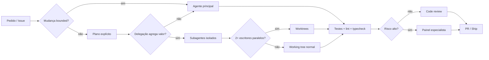

# Vibe Coding Toolkit — Hardened Fork

Este fork mantém as melhores ideias do projeto original de Matheus Gomes e endurece os pontos que mais importam para uso real com agentes de código: autonomia seletiva, isolamento de escrita, quality gates verificáveis, segurança de supply chain e instruções portáveis entre Claude Code, Codex e outros agentes.

> Projeto original: `soumatheusgomes/vibe-coding-toolkit`.
> Este fork: `ElizeuMoyses/vibe-coding-toolkit`.

## O que mudou neste fork

A filosofia continua sendo **entender → planejar → implementar → verificar → revisar**, mas alguns defaults agora são deliberadamente menos dogmáticos:

- **single-agent first**: a sessão principal pode implementar trabalho pequeno e bem delimitado;
- **subagentes sob justificativa**: delegue quando houver isolamento de contexto, paralelismo real ou especialização genuína;
- **worktrees para escritores paralelos**: arquivos diferentes não garantem independência de estado;
- **contrato de tarefa mais completo**: `Files`, `Resources`, `Interfaces`, `Depends-on`, `Generated-artifacts` e `Shared-state`;
- **350 linhas é heurística**, não uma lei universal; arquivo coeso pode receber exceção documentada;
- **warn → error é estratégia de migração**, não obrigação para regra nova sem dívida existente;
- **typed lint deve ser medido**: seu custo tende a acompanhar o typecheck e pode ser pesado em bases grandes;
- **reviews multiagente são baseados em risco**, não obrigatórios em toda mudança;
- **nenhuma instrução remota mutável deve ser executada diretamente de `main`**; use conteúdo vendorizado ou commit/tag imutável;
- **hooks validam o tipo do JSON recebido**, não apenas `null`;
- **`AGENTS.md` é a fonte de verdade cross-tool**; `CLAUDE.md` fica como adaptação específica do Claude.

A rationale completa está em [`docs/03-agent-engineering-hardening.md`](docs/03-agent-engineering-hardening.md).

## Comece por aqui

1. Leia [`docs/00-overview.md`](docs/00-overview.md).
2. Use [`templates/AGENTS.md.template`](templates/AGENTS.md.template) como base do seu projeto.
3. Se usar Claude Code, complemente com [`templates/CLAUDE.md.template`](templates/CLAUDE.md.template).
4. Siga o [`docs/02-playbook-onboarding.md`](docs/02-playbook-onboarding.md).
5. Rode a validação deste próprio toolkit:

```bash
node scripts/validate-toolkit.mjs
```

## Fluxo recomendado



## Princípios que permanecem fortes

- requisitos e premissas explícitos antes de editar;
- mudanças cirúrgicas e sem abstração especulativa;
- testes e comandos reais como evidência de conclusão;
- arquitetura transformada em invariantes mecânicos quando possível;
- dívida técnica mensurável, com baseline e critério de saída;
- memória curta para fatos de alta frequência e documentação longa sob demanda;
- revisão separada da implementação quando o risco justificar;
- contexto e decisões registrados no GitHub, não apenas na conversa do agente.

## Segurança de instruções e dependências

Não peça a um agente para ler e executar um prompt diretamente de uma URL mutável como:

```text
https://raw.githubusercontent.com/<owner>/<repo>/main/...
```

Para instruções executáveis, use uma destas opções:

1. **vendor** o arquivo no repositório consumidor e revise o diff;
2. use uma URL presa a **commit SHA/tag imutável** e revise o conteúdo antes da execução;
3. instale plugins/dependências de fontes revisadas e fixe versão/commit quando o ecossistema permitir.

Conteúdo remoto é entrada não confiável até ser revisado.

## Documentação principal

- [`docs/00-overview.md`](docs/00-overview.md) — filosofia endurecida;
- [`docs/01-installation.md`](docs/01-installation.md) — instalação com supply-chain safety;
- [`docs/02-playbook-onboarding.md`](docs/02-playbook-onboarding.md) — fluxo ponta a ponta;
- [`docs/03-agent-engineering-hardening.md`](docs/03-agent-engineering-hardening.md) — decisões deste fork;
- [`docs/tools/02-subagent-orchestration.md`](docs/tools/02-subagent-orchestration.md) — quando delegar e como paralelizar;
- [`docs/tools/06-eslint-biome-quality-gates.md`](docs/tools/06-eslint-biome-quality-gates.md) — gates e heurísticas;
- [`docs/tools/10-hooks-best-practices.md`](docs/tools/10-hooks-best-practices.md) — hooks robustos;
- [`docs/prompts/03-multi-agent-code-review.md`](docs/prompts/03-multi-agent-code-review.md) — review baseada em risco;
- [`docs/prompts/08-eslint-quality-gates-install.md`](docs/prompts/08-eslint-quality-gates-install.md) — instalação segura dos gates;
- [`docs/prompts/09-file-size-refactor.md`](docs/prompts/09-file-size-refactor.md) — refatoração por responsabilidade.

## Validação contínua

O workflow `.github/workflows/validate-toolkit.yml` executa `scripts/validate-toolkit.mjs` em pushes e pull requests. Ele verifica o parser real do exemplo de hooks e impede que os atalhos críticos voltem a executar prompts mutáveis vindos de `main`.

## Licença e créditos

O projeto continua sob a licença MIT presente em [`LICENSE`](LICENSE). A base, a maior parte da documentação histórica e a metodologia original vêm de `soumatheusgomes/vibe-coding-toolkit`; este fork adiciona uma camada de hardening para uso agent-first mais seguro e portável.
